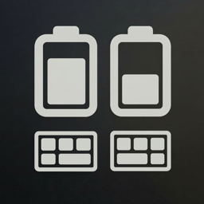
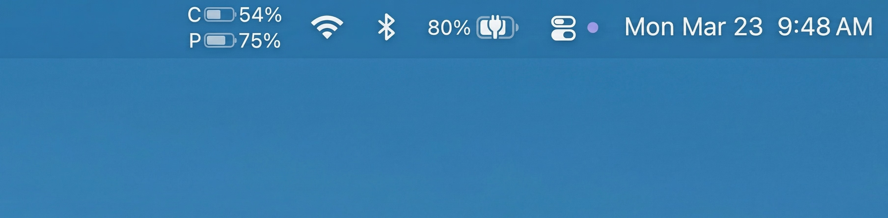

<p align="center">
  
</p>

# ZMK Battery Bar

A macOS menu bar app that displays battery levels from ZMK split keyboards via BLE.




## Features

- **Two-line status bar display** — Shows Central (C) and Peripheral (P) battery levels with custom-drawn battery icons
- **BLE Battery Service** — Reads battery levels via standard BLE Battery Service (0x180F) with notification subscription
- **Auto Central/Peripheral detection** — Uses BLE descriptor (User Description) to identify each half of the split keyboard
- **Multiple keyboard support** — Register and switch between multiple ZMK keyboards
- **Auto-reconnect** — Automatically reconnects with exponential backoff when the keyboard disconnects
- **Launch at Login** — Optional auto-start via SMAppService

## Requirements

- macOS 14 (Sonoma) or later
- A ZMK-powered split keyboard with BLE Battery Service enabled

### ZMK Configuration

To display both Central and Peripheral battery levels, add the following to your Central side's `.conf` file:

```ini
CONFIG_ZMK_BATTERY_REPORTING=y
CONFIG_ZMK_SPLIT_BLE_CENTRAL_BATTERY_LEVEL_PROXY=y
CONFIG_ZMK_SPLIT_BLE_CENTRAL_BATTERY_LEVEL_FETCHING=y
```

## Install

```sh
brew install --cask itouuuuuuuuu/tap/zmk-battery-bar
```

## Usage

1. Launch ZMK Battery Bar — it appears in the menu bar with `C` and `P` battery levels
2. Click the status bar item to open the popover
3. If no keyboard is connected, click **Add Keyboard...** to scan for BLE devices
4. Select your ZMK keyboard from the discovered devices list
5. Battery levels update automatically via BLE notifications

## How It Works

1. On launch, the app connects to the previously saved keyboard via `retrievePeripherals(withIdentifiers:)`
2. It discovers the BLE Battery Service (0x180F) and Battery Level Characteristic (0x2A19)
3. Descriptor `0x2901` (User Description) is read to determine Central vs Peripheral
4. Battery level notifications are subscribed to for real-time updates, with 60-second polling as fallback
5. The status bar icon is rendered as an `NSImage` using SwiftUI `ImageRenderer`

## Development

```sh
# Debug build and run
swift build
swift run ZMKBatteryBar

# Release .app bundle (ad-hoc signing for local use)
./scripts/build-app.sh
cp -r "build/ZMK Battery Bar.app" /Applications/

# Release .app bundle with Developer ID signing
./scripts/build-app.sh "Developer ID Application: Your Name (TEAMID)" "1.0.0"
```

### Release

Releases are automated via GitHub Actions. Pushing a version tag triggers the full pipeline:

```sh
git tag v1.2.0
git push origin v1.2.0
```

This will automatically:

1. Build the app in release mode
2. Sign with Developer ID certificate (hardened runtime)
3. Notarize with Apple and staple the ticket
4. Create a GitHub Release with the signed zip
5. Update the [Homebrew Cask](https://github.com/itouuuuuuuuu/homebrew-tap) with the new version and SHA256

#### Required GitHub Secrets

| Secret | Description |
|---|---|
| `DEVELOPER_ID_CERTIFICATE_BASE64` | Base64-encoded .p12 certificate |
| `DEVELOPER_ID_CERTIFICATE_PASSWORD` | Password for the .p12 file |
| `APPLE_ID` | Apple ID email for notarization |
| `APPLE_ID_PASSWORD` | App-specific password for notarization |
| `APPLE_TEAM_ID` | Apple Developer Team ID |
| `HOMEBREW_TAP_TOKEN` | GitHub PAT with write access to homebrew-tap repo |

#### Manual Release (without CI)

```sh
export APPLE_ID="your@email.com"
export APPLE_ID_PASSWORD="xxxx-xxxx-xxxx-xxxx"
export APPLE_TEAM_ID="XXXXXXXXXX"
./scripts/release.sh 1.2.0 "Developer ID Application: Your Name (TEAMID)"
```

### Architecture

| Directory | Description |
|---|---|
| `Sources/.../App/` | Entry point, AppDelegate, NSStatusItem, NSPanel popover |
| `Sources/.../BLE/` | CoreBluetooth manager, device discovery, battery reading |
| `Sources/.../Views/` | SwiftUI views (status bar, popover, keyboard list) |
| `Sources/.../Models/` | BatteryState (@Observable), AppSettings (UserDefaults), KeyboardDevice |
| `Sources/.../Utilities/` | Launch at login (SMAppService wrapper) |

## License

MIT
